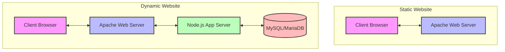

# Lab: Deploying Static and Dynamic Websites

This lab helps students develop practical skills in deploying static and dynamic websites. You'll learn the differences between these two types of websites and how to set them up in real-world scenarios.

## Architecture Overview



## Prerequisites
- Basic understanding of web servers
- Familiarity with command line interface
- Text editor or IDE
- Git installed

## Getting Started
Please follow the step-by-step instructions of your operating system's guide from the Lab Activities section.

## Deployment Options

You can choose between two deployment methods:

1. **Traditional Setup**: Install and configure services directly on your machine
2. **Docker Setup**: Use Docker Compose to run everything in containers


## Project Structure

```
/
├── docs/                    # Detailed documentation
├── static-sites/           
│   ├── site-a/             # First static website
│   │   └── index.html
│   └── site-b/             # Second static website
│       └── index.html
├── nodejs/                 # Node.js applications
│   ├── simple-server/      # Basic HTTP server
│   │   └── server.js
│   └── blog-app/          # Dynamic blog application
│       ├── package.json
│       └── server.js
├── config/                # Configuration files
│   └── httpd.conf        # Apache configuration
├── sql/                  # Database initialization
│   └── init.sql         # Initial database schema
└── docker-compose.yml    # Docker composition file
```

## Lab Activities

### Exercise 1: Static Website Deployment
Learn how to deploy multiple static websites using Apache virtual hosts.

Choose your operating system:
- [Windows Guide](docs/exercises/ex1-windows-guide.md)
- [macOS Guide](docs/exercises/ex1-macos-guide.md)
- [Ubuntu Guide](docs/exercises/ex1-ubuntu-guide.md)

### Exercise 2: Dynamic Website with Node.js
Set up a dynamic blog website using Node.js and MariaDB.

Choose your operating system:
- [Windows Guide](docs/exercises/ex2-windows-guide.md)
- [macOS Guide](docs/exercises/ex2-macos-guide.md)
- [Ubuntu Guide](docs/exercises/ex2-ubuntu-guide.md)

### Exercise 3: Docker Deployment (Optional)
Learn how to containerize and deploy web applications using Docker.

- [Docker Setup Guide](docs/exercises/ex3-docker-guide.md)

## Additional Resources

### Server Setup Guides
- [Node.js Server Setup](docs/nodejs-server/setup-guide.md)
- [Dynamic Site Architecture](docs/dynamic-site/setup-guide.md)

### Apache Setup Guides
- [Windows Apache Setup](docs/apache-setup/windows-guide.md)
- [macOS Apache Setup](docs/apache-setup/macos-guide.md)
- [Ubuntu Apache Setup](docs/apache-setup/ubuntu-guide.md)

## Troubleshooting

### Common Issues and Solutions

#### Apache Issues
1. Port 80 already in use:
   ```bash
   # Windows (Command Prompt as Admin):
   netstat -ano | findstr :80
   taskkill /PID <PID> /F
   
   # macOS/Linux:
   sudo lsof -i :80
   sudo kill <PID>
   ```

2. Permission denied:
   ```bash
   # Windows:
   # Run as Administrator
   
   # macOS/Linux:
   sudo chmod -R 755 /path/to/website
   sudo chown -R www-data:www-data /path/to/website
   ```

#### Node.js Issues
1. Module not found:
   ```bash
   # Reinstall dependencies
   cd nodejs/blog-app
   rm -rf node_modules
   npm install
   ```

2. Port 3000 in use:
   ```bash
   # Windows:
   netstat -ano | findstr :3000
   taskkill /PID <PID> /F
   
   # macOS/Linux:
   lsof -i :3000
   kill <PID>
   ```

#### Database Issues
1. Connection refused:
   ```bash
   # Check if MariaDB is running
   # Windows (XAMPP):
   Check MySQL service in XAMPP Control Panel
   
   # macOS:
   brew services restart mysql
   
   # Ubuntu:
   sudo systemctl restart mariadb
   ```

2. Access denied:
   ```sql
   # Log into MySQL/MariaDB
   mysql -u root -p
   
   # Grant permissions
   GRANT ALL PRIVILEGES ON blog_app.* TO 'user'@'localhost';
   FLUSH PRIVILEGES;
   ```


## ⚠️ Educational Purpose

These examples are for learning purposes only and demonstrate basic concepts. They are not production-ready and do not implement security best practices.

## Contributing
Feel free to submit issues and enhancement requests