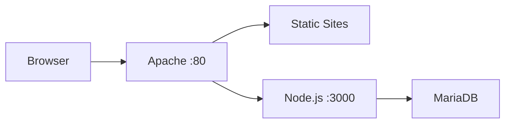

# Exercise 3: Understanding Docker Setup

This guide explains how our Docker-based web application setup works, focusing on the architecture and interaction between components.

## Architecture Overview

Our setup consists of three main services:

1. **Apache (Web Server)**
   - Acts as the front-facing web server
   - Handles static file serving
   - Routes dynamic requests to Node.js
   - Manages virtual hosts for multiple sites

2. **Node.js (Application Server)**
   - Processes dynamic content requests
   - Handles database operations
   - Generates HTML responses
   - Implements blog functionality

3. **MariaDB (Database)**
   - Stores blog posts and other data
   - Provides persistent storage
   - Handles data queries

## How It Works

### 1. Request Flow


1. **Initial Request**
   - User visits a site (e.g., blog-app.local)
   - Request hits Apache on port 80

2. **Request Routing**
   - Apache checks virtual host configurations
   - For static sites: serves directly from `/var/www/html`
   - For blog app: proxies to Node.js on port 3000

3. **Dynamic Content**
   - Node.js processes the request
   - Queries MariaDB if needed
   - Generates and returns HTML

### 2. Container Communication

Our services communicate through the `webnet` Docker network:

```
Apache <---> Node.js <---> MariaDB
  :80      :3000      :3306
```

- Containers can reference each other by service name
- Internal DNS resolution is handled by Docker
- Network is isolated from host system

### 3. Data Persistence

1. **Database Data**
   - Stored in named volume: `mariadb_data`
   - Survives container restarts
   - Initialized by `./sql/init.sql`

2. **Static Files**
   - Mounted from host: `./static-sites`
   - Changes reflect immediately
   - No container rebuild needed

3. **Configuration**
   - Virtual hosts: `./config/vhosts`
   - Mounted into Apache container
   - Hot-reloadable with Apache restart

## Key Configuration Files

### 1. docker-compose.yml
```yaml
version: '3.8'

services:
  apache:
    image: httpd:2.4
    ports:
      - "80:80"
    volumes:
      - ./static-sites:/var/www/html
      - ./config/vhosts:/usr/local/apache2/conf/extra/vhosts
    depends_on:
      - nodejs
    networks:
      - webnet

  nodejs:
    build: ./nodejs
    environment:
      - DB_HOST=mariadb
      - DB_USER=root
      - DB_PASSWORD=example
      - DB_NAME=blog_app
    depends_on:
      - mariadb
    networks:
      - webnet

  mariadb:
    image: mariadb:10.5
    environment:
      - MYSQL_ROOT_PASSWORD=example
      - MYSQL_DATABASE=blog_app
    volumes:
      - mariadb_data:/var/lib/mysql
      - ./sql:/docker-entrypoint-initdb.d
    networks:
      - webnet

networks:
  webnet:
    driver: bridge

volumes:
  mariadb_data:
```

Key points:
- Service dependencies ensure proper startup order
- Environment variables configure services
- Volume mounts persist data and configurations
- Network setup enables inter-container communication

### 2. Virtual Host Configuration
```apache
<VirtualHost *:80>
    ServerName blog-app.local
    ProxyPreserveHost On
    ProxyPass / http://nodejs:3000/
    ProxyPassReverse / http://nodejs:3000/
</VirtualHost>
```

Key points:
- `ProxyPass` directs requests to Node.js container
- Uses Docker DNS to resolve `nodejs` hostname
- Preserves original host headers

## Common Operations

### Starting the Environment
```bash
# Build and start all services
docker-compose up -d

# View running containers
docker-compose ps

# Check logs
docker-compose logs -f
```

### Accessing Services
```bash
# Apache logs
docker-compose logs apache

# Node.js logs
docker-compose logs nodejs

# Database shell
docker-compose exec mariadb mysql -u root -p
```

### Restarting Services
```bash
# Restart single service
docker-compose restart nodejs

# Rebuild and restart
docker-compose up -d --build nodejs
```

## Troubleshooting

### Container Issues
1. Check container status:
   ```bash
   docker-compose ps
   ```

2. View logs:
   ```bash
   docker-compose logs -f [service]
   ```

3. Inspect network:
   ```bash
   docker network inspect webnet
   ```

### Database Connection
1. Verify MariaDB is running:
   ```bash
   docker-compose ps mariadb
   ```

2. Check Node.js can reach MariaDB:
   ```bash
   docker-compose exec nodejs ping mariadb
   ```

### Apache Proxy
1. Verify virtual host configuration:
   ```bash
   docker-compose exec apache httpd -t
   ```

2. Check Node.js is accessible:
   ```bash
   docker-compose exec apache curl nodejs:3000
   ``` 